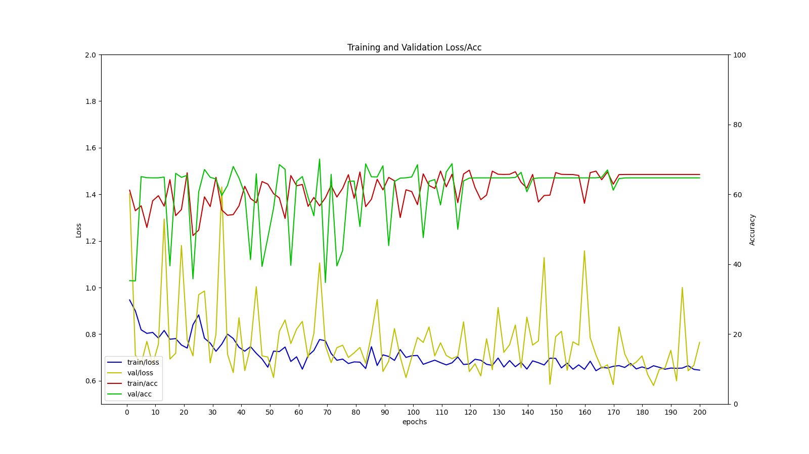

# pytorch_3d_medical_classification

## Training datasets
  Lung CT images(nifti file format)
  
  * train : 68 patients
  * val   : 16 patients

## Model architecture
  * 3d ResNet

## Train/Val result graph
  * top train accuracy: 0.657
  

## Environment
  * Python 3.6.9
  * Pytorch 1.7.1
